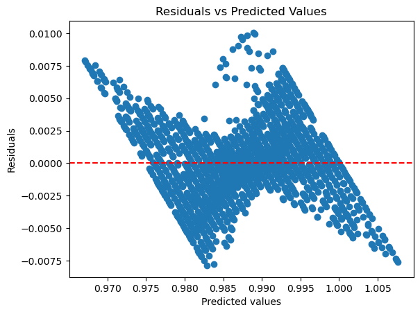
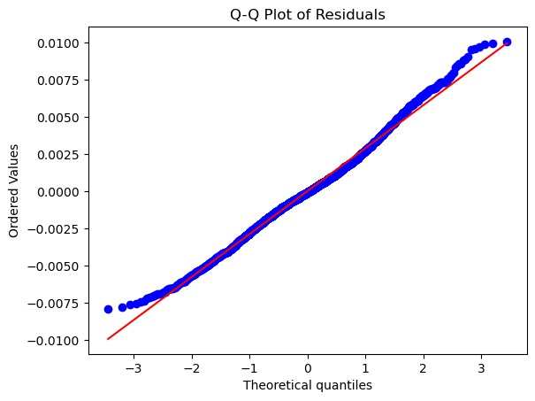
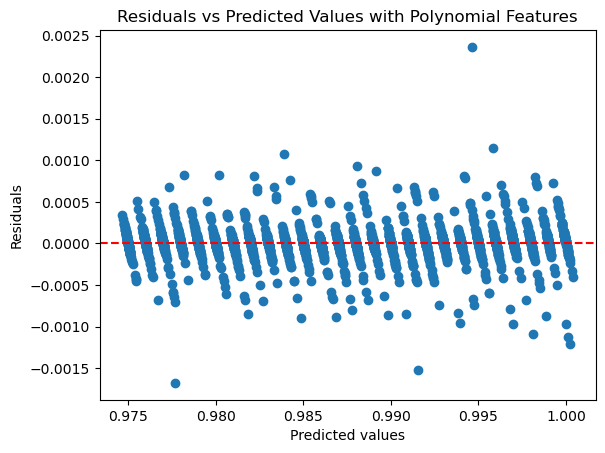
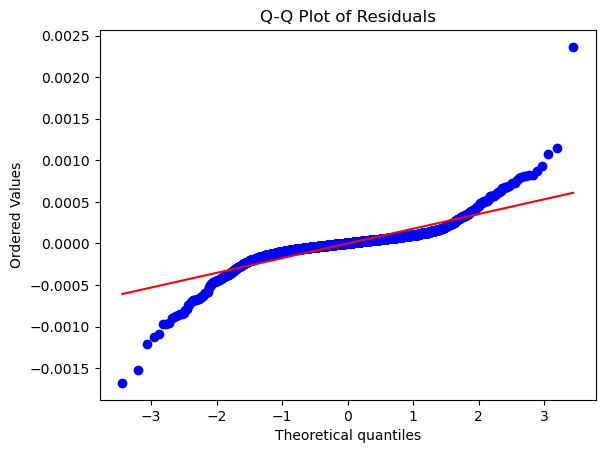
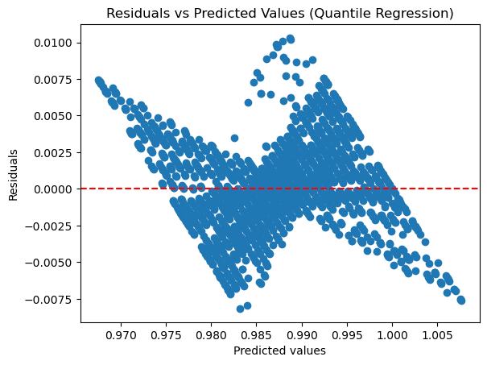
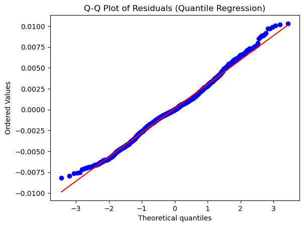
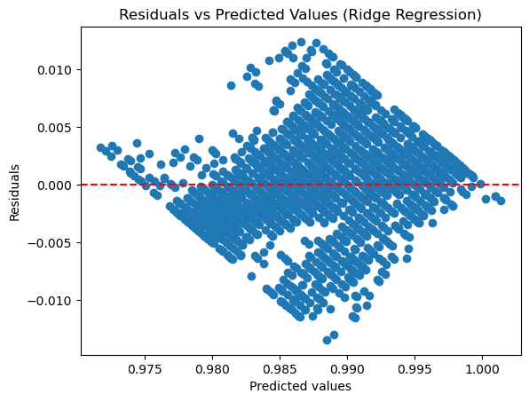
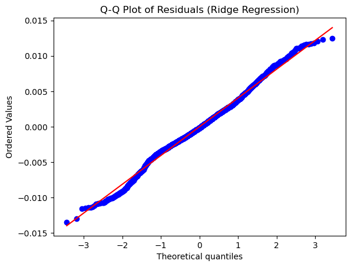

# Naval Vessel Turbine Decay Model

## Table of Contents
1. [Overview](#overview)
2. [Dataset](#dataset)
3. [Curation](#curation)
4. [Hypothesis Test](#Hypothesis_Test)
5. [Model](#model)
6. [Application](#application)


## **Overview**
This project aims to use a dataset of telemetered machine status & health measurements to train a linear regression model that predicts efficiency of the machine.  Once trained, the model will be deployed via Streamlit and accept user input for predictions.  A secondary function of the application will be the ability to select a target from the list of features and use the remaining features to create a new model that predicts the selected target.

## **Dataset**
The dataset for this project was pulled from the UC Irvine Machine Learning Repository.  It consists of 16 features capturing the status of gas turbine based naval propulsion plants.  There are 11934 records and no missing values.

## **Curation**
The dataset was manipulated for use in a linear regression model in two ways. 

First, the lever position was broken up into bins in an attempt to reduce noise/outliers as well as reduce dimensionality for model proformance.

```python
num_bins = 9
in_edges = np.linspace(data['LeverPosition'].min(), data['LeverPosition'].max(), num_bins + 1)
data['LeverPosition_bin'] = pd.cut(data['LeverPosition'], bins=bin_edges, labels=False, include_lowest=True)
```

Second, port and starboard propeller torque measurements were averaged into one column to prevent skewed coefficients caused by high co-linearity.

```python
data["avg_prop_torque[kN]"] = ((data['StarboardPropellerTorque(Ts)[kN]'] + data['PortPropellerTorque(Tp)[kN]']) / 2)
```

## **Hypothesis Test**
The hypothesis test for this project consisted of a simple one sided t-test to determine if there was a statistcal difference between fuel flow rates and the lowest and highest lever position. 

The test determined that the null could be definitively rejected.  Detailed methodology and results are available in the [hypothesis test notebook](notebooks/hypo_test.ipynb).

## **Model**
I investigated several models for this regression.  The models and their results are listed below. Ultimately, I chose RidgeRegression for my model.

1. **Standard Least Squares Linear Regression:** A baseline model to establish initial performance metrics.

    
    

2. **Linear Regression with Polynomial Features:** Introduced non-linearity by adding polynomial terms.

    
    

3. **Quantile Regression:** Examined the conditional quantiles of the target variable, offering robustness against outliers.

    
    

4. **Ridge Regression:** Selected for its ability to handle multicollinearity effectively, which was evident in the improved residual patterns.

    
    

## **Application**

The application features two pages:

1. **Turbine Coef Prediction:** Users can input parameters and receive an efficiency coefficient, indicating the turbine’s performance under the given conditions.
2. **Create Your Own Prediction:** This page allows users to explore different targets by building custom models on-the-fly. Ideal for scenario analysis and what-if assessments.

The application is live until August 19, 2024, and can be accessed [here](https://rbpowellga-naval-vessel-condition-app-2awaea.streamlit.app/).